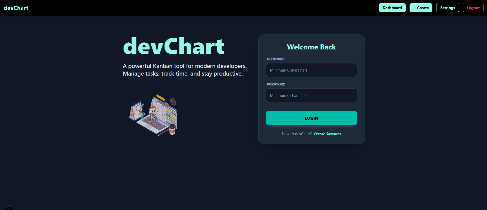
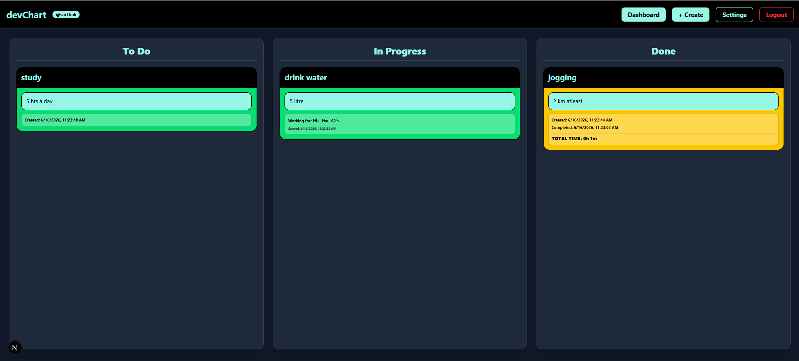
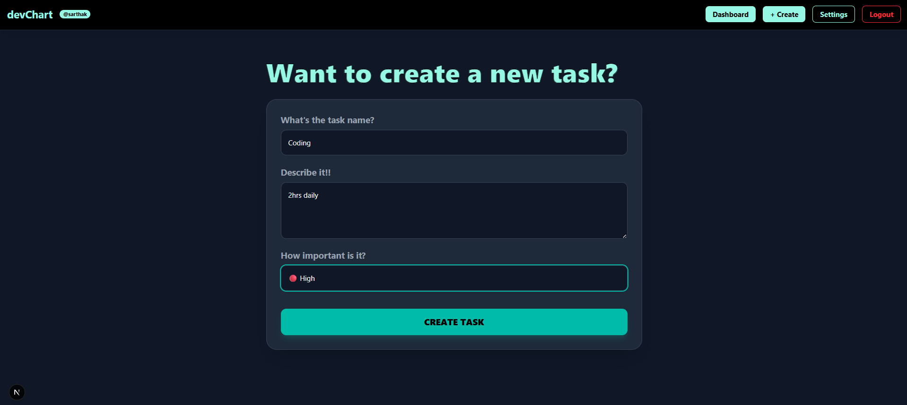

# devChart 🚀

**devChart** is a modern, Kanban-style task management application designed for developers and small teams to stay productive and track their progress in real-time.

---

## 📖 Project Overview

devChart provides a streamlined workflow to manage your tasks from conception to completion. Built with a focus on speed and simplicity, it features an interactive drag-and-drop interface, live time-tracking for active tasks, and individual user accounts to keep your data secure and private.

## ✨ Features Implemented

-   **⚡ Optimistic UI Updates:** Task movements and deletions reflect instantly in the interface, ensuring a high-performance, "snappy" user experience by syncing with the database in the background.
-   **🖱️ Native Drag-and-Drop:** A fully interactive Kanban experience where users can visually transition tasks between stages with ease.
-   **🕒 Dynamic Lifecycle Tracking:** 
    *   **To Do:** Automatically logs the exact moment of task creation.
    *   **In Progress:** Features a live, per-second timer that tracks active development time the moment a task is moved.
    *   **Done:** Calculates and displays the total "Time to Complete" once a task reaches the final stage.
-   **🔒 Secure Multi-User Access:** Complete authentication system with JWT and Bcrypt, ensuring data isolation so every user has their own private workspace.
-   **⚙️ Smart Task Management:** Column-level clearing actions and priority-based color coding for instant visual hierarchy.

## 🛠️ Technology Stack Used

-   **Framework:** [Next.js 15+](https://nextjs.org/) (App Router)
-   **Language:** [TypeScript](https://www.typescriptlang.org/)
-   **Frontend:** [React 19](https://react.dev/), [Tailwind CSS 4](https://tailwindcss.com/)
-   **Database:** [MongoDB](https://www.mongodb.com/) via [Mongoose](https://mongoosejs.com/)
-   **Authentication:** JSON Web Tokens (JWT) & Bcryptjs
-   **State Management:** React Hooks (useState, useEffect, useMemo)

## 🚀 Setup Instructions

Follow these steps to get the project running locally on your machine:

### 1. Clone the repository
```bash
git clone https://github.com/your-username/devChart.git
cd devChart
```

### 2. Install dependencies
```bash
npm install
```

### 3. Environment Variables
Create a `.env` file in the root directory and add the following:
```env
MONGODB_URI=your_mongodb_connection_string
JWT_SECRET=your_secret_key_for_auth
```

### 4. Run the development server
```bash
npm run dev
```
Open [http://localhost:3000](http://localhost:3000) in your browser.

---

## 🚢 Deployment Instructions

The project is optimized for deployment on **Vercel**:

1.  Push your code to a GitHub repository.
2.  Import the project into [Vercel](https://vercel.com/new).
3.  Add your `MONGODB_URI` and `JWT_SECRET` as Environment Variables in the Vercel dashboard.
4.  Click **Deploy**.

---

## 📸 Screenshots

### 1. Landing & Login


### 2. Kanban Dashboard


### 3. Task Creation


---

## ⚠️ Known Limitations

-   **Browser Compatibility:** Drag-and-drop is optimized for desktop browsers; mobile touch-drag support is currently limited.
-   **Password Recovery:** There is currently no "Forgot Password" email flow.
-   **Collaborative Editing:** Tasks are currently private to individual users; real-time team collaboration on the same board is a planned future update.
-   **File Storage:** Tasks do not currently support image or file attachments.

---
